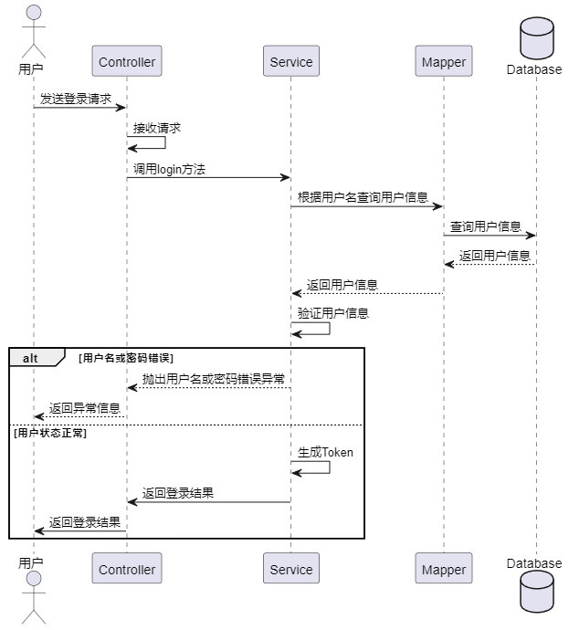
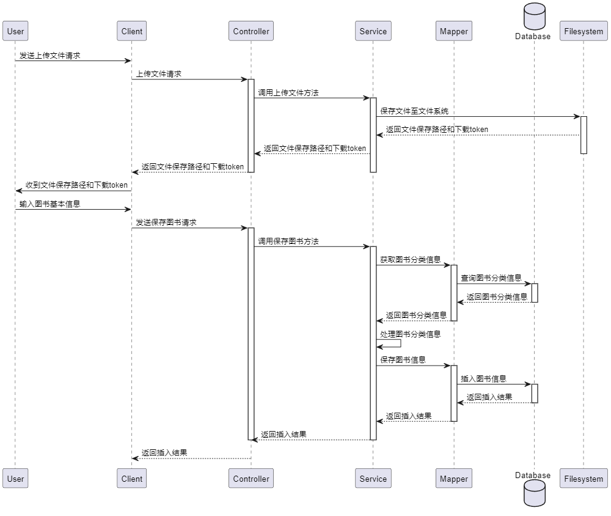
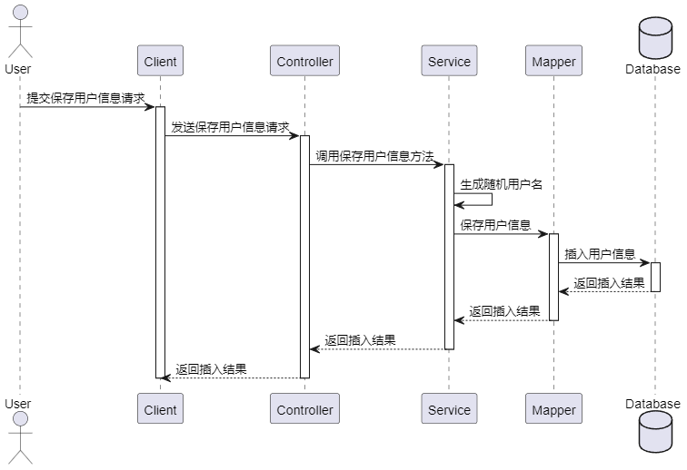
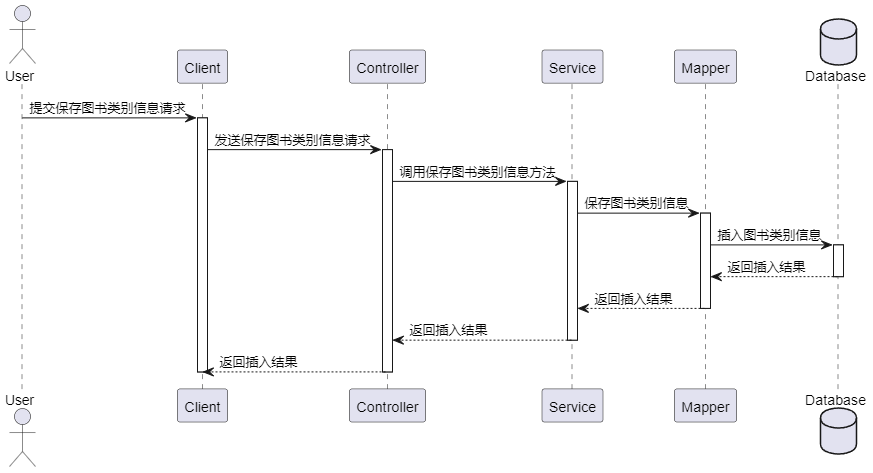
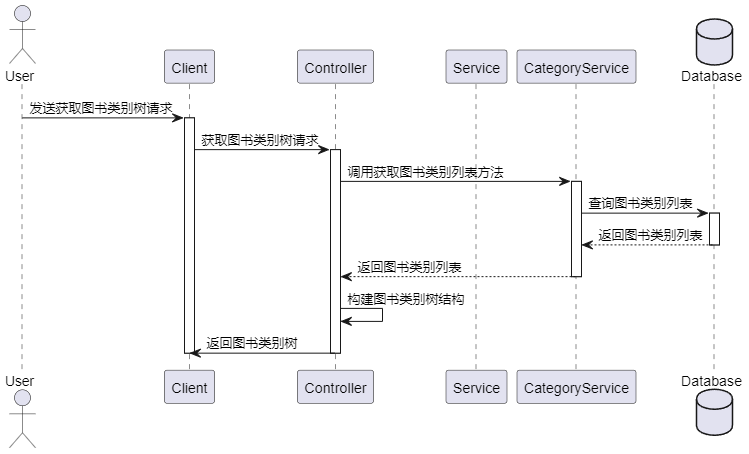
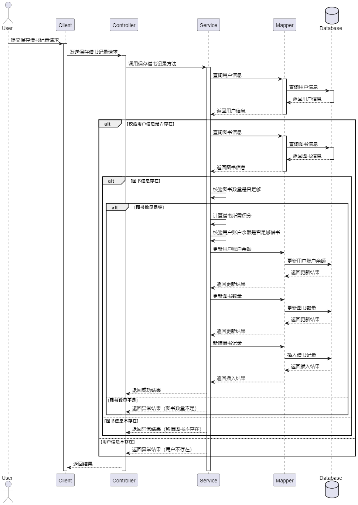
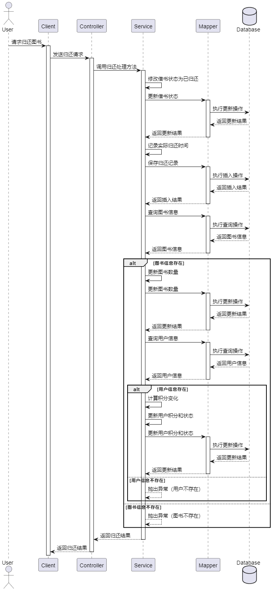
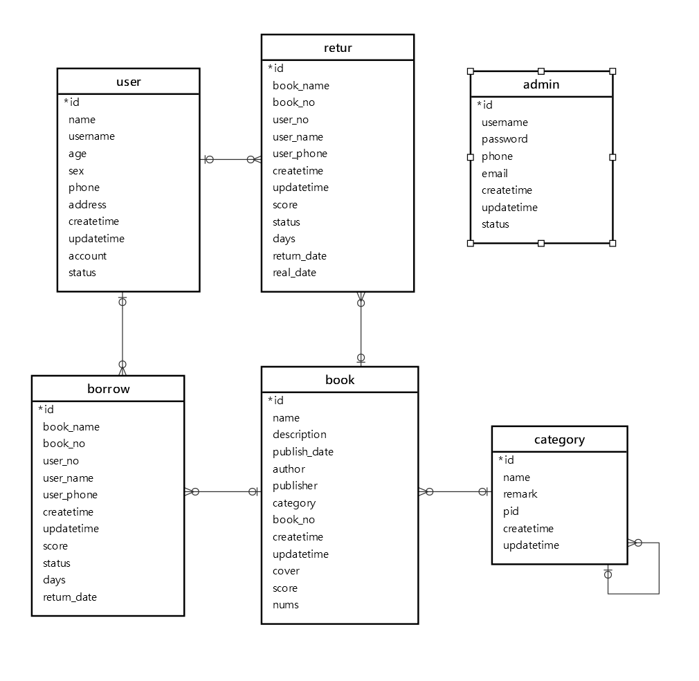
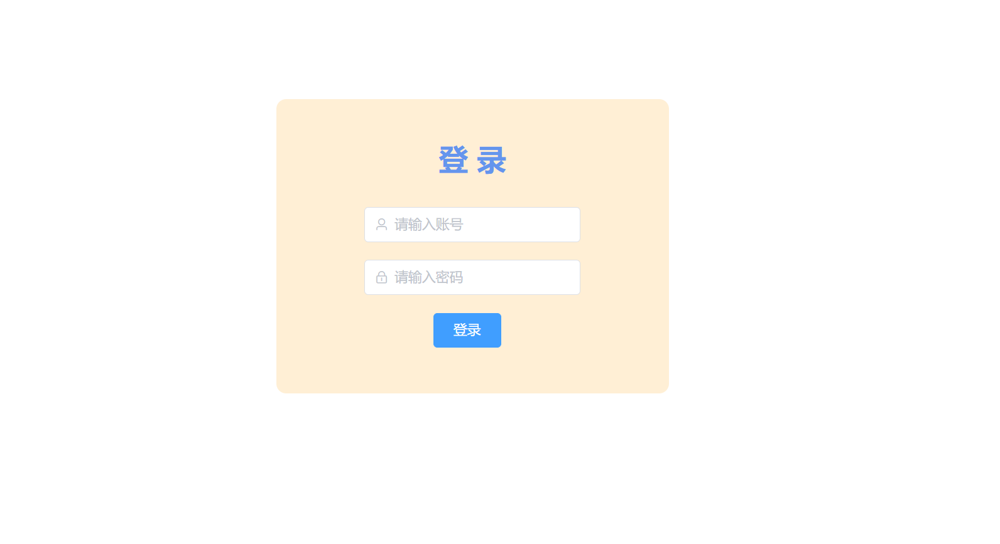

# 基于Vue.js框架的图书管理系统的设计与实现

> 公开脱敏版：保留论文正文与技术插图；学校模板、页眉页脚、校徽、身份元数据不进入公开文件，含个人资料或凭据的截图已隐藏。

目 录

## 绪论

### 选题背景

在当今信息时代，图书管理系统已成为图书馆、学校和企业等机构不可或缺的重要工具。随着信息量的急剧增长和数字化技术的发展，传统的手工管理已无法满足日益增长的图书管理需求。因此，基于Vue.js框架的图书管理系统的设计和实现变得至关重要。

传统的图书管理往往面临诸多问题，包括手工记录容易出错、借阅归还流程繁琐、信息检索不便等。而借助现代化的图书管理系统，可以有效解决这些问题，提高图书管理的效率和便捷性。Vue.js作为一种流行的JavaScript框架，具有响应式的数据绑定和组件化的开发模式，为构建用户友好、交互性强的图书管理系统提供了良好的基础。

同时，结合SpringBoot、MySQL和MyBatis等后端技术，可以实现系统的稳定性、安全性和可扩展性。SpringBoot作为一种快速开发框架，能够简化后端开发流程，提高开发效率；MySQL作为一种开源的关系型数据库，能够存储和管理大量的图书信息；MyBatis作为一种优秀的持久层框架，能够简化数据库操作，提高系统的性能。

因此，基于Vue.js框架的图书管理系统的设计和实现具有重要的现实意义。它不仅能够提升图书管理的效率和便捷性，还能够为图书馆、学校和企业等机构提供一种现代化、智能化的图书管理解决方案，推动图书管理工作向数字化、智能化方向迈进，满足人们日益增长的图书管理需求，促进知识的传承和交流。

### 选题目的与意义

设计与实现基于Vue.js框架的图书管理系统的目的在于提供一个高效、便捷、智能的图书管理解决方案。此举旨在满足日益增长的图书管理需求，促进图书管理工作的现代化和数字化发展。

该系统旨在提升图书管理的效率和精度。传统的手工管理容易出现错误和遗漏，而基于Vue.js框架的图书管理系统能够实现自动化的图书记录、借阅和归还等功能，大大减少了人为错误，提高了管理的准确性和效率。

系统旨在优化用户体验和服务质量。用户可以通过系统快速查询所需图书、进行借阅续借操作，实现了图书信息的便捷获取和个性化服务，提升了用户满意度和忠诚度。

系统的设计与实现也有利于图书管理工作的数字化转型。随着信息技术的不断发展，数字化图书管理已成为趋势。基于Vue.js框架的图书管理系统提供了现代化、智能化的管理工具，推动了图书管理工作向数字化、智能化方向迈进。

设计与实现基于Vue.js框架的图书管理系统，旨在提升图书管理效率、优化用户体验，推动图书管理工作的现代化和数字化发展，具有重要的实际意义和深远的社会价值。

### 国内外发展现状

国内外图书管理系统的发展现状显示了数字化技术在图书管理领域的广泛应用和持续发展。在国外，许多图书馆和机构已经采用了先进的图书管理系统，如Ex Libris Alma、SirsiDynix Symphony、Koha等。这些系统通过集成多种功能模块，实现了图书采编、编目分类、借阅归还、统计分析等功能，为用户提供了便捷的图书管理服务。

国内图书管理系统的发展也日益成熟。一些大型图书馆和高校图书馆已经建立了自己的图书管理系统，如图书馆的图书馆综合管理系统、图书馆的PKULIB系统等。这些系统不仅具备了基本的图书管理功能，还提供了个性化的服务和定制化的解决方案，满足了用户的多样化需求。

随着互联网和移动互联网的快速发展，图书管理系统也向着在线化、智能化的方向发展。越来越多的图书馆采用了Web端和移动端的图书管理系统，用户可以通过网页或手机App实现图书查询、借阅续借、预约服务等功能，极大地提升了图书管理的便捷性和用户体验。

除了图书管理功能，一些先进的图书管理系统还引入了数据分析和人工智能等技术，通过对用户行为和阅读偏好的分析，为图书馆提供更精准的服务和推荐，推动图书馆服务向个性化、智能化方向发展。

国内外图书管理系统的发展现状表明了数字化技术在图书管理领域的广泛应用和不断创新。未来，随着技术的不断进步和用户需求的不断变化，图书管理系统将会更加智能化、个性化，为用户提供更优质的图书管理服务。

### 章节内容安排

## 第一章：主要讲述本题目开发背景，开发目的与意义，国内外发展现状。

## 第二章：主要阐述本系统使用到的关键技术：Spring Boot快速脚手架，MySQL数据库，Vue前端框架，MyBatis数据中间处理框架。

## 第三章：对系统进行需求分析，进行功能性需求分析，确定系统的使用群体，确定系统的基本功能；对系统进行非功能性需求分析。

## 第四章：阐述系统的架构设计，总体设计，对系统关键功能进设计，并画出关键功能的序列图；对系统数据库进行设计，使用三段式设计系统的数据库。

## 第五章：合理运用文字，系统实现界面，代码对实现的功能进行阐述，关键代码进行解释。

## 第六章：使用黑盒测试方法对系统的关键功能：登录，注册，图书管理，借书还书进行测试，保证系统的稳定性。

## 第七章：对本系统的设计与开发工作进行总结。

## 关键技术介绍

### 关键性开发技术介绍

#### Spring Boot

Spring Boot是Spring框架的进化产物，以其约定大于配置的理念，极大地简化了Spring框架的配置繁琐性。通过引入Spring Boot Starter和结合Maven工具，开发人员能够迅速搭建起整合了Spring、Spring MVC、MyBatis等框架的系统，形成一套高效的SSM框架。

它就像一把魔法钥匙，能够以惊人的速度解锁开发过程中的诸多烦扰。Spring Boot通过一系列默认配置，让开发者可以不再为琐碎的配置而烦恼，而是专注于业务逻辑的实现。它的独特之处在于不仅仅提供了快速搭建的能力，还通过内置Tomcat服务器的方式，使得整个开发过程更加轻松，不再需要额外的服务器配置和部署步骤。

#### Vue框架

Vue是一种流行的JavaScript前端框架，以其简洁易用、响应式数据绑定、组件化开发等特点而闻名。在图书管理系统中，Vue扮演着关键角色。它帮助开发者构建交互性强、用户友好的界面，通过数据绑定和事件处理实现页面与用户的交互功能，提升用户体验。Vue的组件化开发能够有效管理和复用系统中的功能模块，提高了系统的可维护性和扩展性。同时，Vue的响应式数据绑定机制确保了数据变化时界面的及时更新，保证系统的实时性和准确性。在构建单页面应用时，Vue Router提供了便捷的路由管理工具，使得用户操作更加流畅和自然。综上所述，Vue在图书管理系统中发挥着重要作用，为系统的开发提供了高效、响应式的解决方案。

#### MySQL数据库

MySQL是一种流行的关系型数据库管理系统，以其高性能、稳定性和开源免费等特点而广泛应用。MySQL支持SQL语言，能够存储和管理大量结构化数据，适用于各种规模的应用场景。

在图书管理系统中，MySQL扮演着重要角色。首先，MySQL用于存储和管理系统中的各类数据。通过MySQL的高效存储和检索功能，可以快速地对数据进行增删改查操作，保证了系统的数据安全和完整性。其次，MySQL提供了可靠的事务处理机制，保证了数据的一致性和可靠性，避免了数据丢失或损坏的风险。此外，MySQL还支持数据备份和恢复功能，能够在系统发生故障时快速恢复数据，保障系统的稳定运行。综上所述，MySQL作为图书管理系统的数据库，能够有效地存储和管理系统中的数据，保证系统的稳定性、可靠性和安全性，为系统提供了可靠的数据支撑和保障。

#### MyBatis

MyBatis是一种Java持久层框架，它提供了一种优雅的方式来将Java对象与数据库表进行映射，并通过XML或注解配置SQL语句，实现了对数据库的访问操作。MyBatis具有简单易用、灵活性高、性能优越等特点。

在图书管理系统中，MyBatis扮演着重要角色。首先，MyBatis通过配置SQL语句，实现了对数据库的CRUD操作，包括查询、插入、更新和删除等，使得开发者能够以面向对象的方式操作数据库，提高了开发效率。其次，MyBatis支持动态SQL语句的生成，能够根据不同的条件动态拼接SQL语句，实现灵活的数据查询和操作。此外，MyBatis还提供了一级缓存和二级缓存机制，能够有效地减少数据库访问次数，提升系统的性能和响应速度。综上所述，MyBatis在图书管理系统中发挥着重要作用，通过简单灵活的方式实现了对数据库的访问操作，提高了系统的开发效率和性能表现。

### 其它相关技术

#### HTTP请求

HTTP（Hypertext Transfer Protocol）是一种用于传输超文本数据的应用层协议，它是Web的基础之一。通过HTTP协议，客户端（通常是浏览器）可以向服务器发送请求，并从服务器接收响应，实现了客户端与服务器之间的通信和数据交换。

在图书管理系统中，HTTP请求技术扮演着至关重要的角色。首先，图书管理系统通常是基于Web的应用程序，客户端需要向服务器发送各种类型的请求。HTTP请求技术通过定义不同的请求方法（如GET、POST、PUT、DELETE等），实现了对不同操作的标准化和规范化，确保了请求的准确性和有效性。其次，HTTP请求技术支持在请求头中添加各种参数和信息，如请求头、请求体、Cookie等，可以传递用户身份认证信息、请求参数等，从而实现了用户身份的验证和数据的传递。此外，HTTP请求技术还支持跨域请求、文件上传、会话管理等功能，为图书管理系统的开发和运行提供了丰富的功能和灵活性。

## 系统分析

### 功能需求分析

#### 管理员用户需求分析

管理员可以在本系统中进行会员管理、图书类别管理、图书管理、借书管理、还书管理以及管理员管理等操作。管理员可以通过系统实现会员信息的录入、修改和查询，对图书类别进行管理和分类展示，管理图书的入库、出库、状态等，以及记录会员借书情况和确认还书，同时也可以管理管理员账号和权限。系统的用例图3.1展示了管理员在系统中的主要操作，为管理员提供了便捷、高效的图书管理服务。

图3.1 用例图

系统登录用例如表3.1所示，用户输入账号与密码进行系统登录，系统对用户输入的密码进行加密，然后判断输入的数据是否正确，如果正确提示登录成功，并跳转首页，如果错误提示错误信息。

表3.1 系统登录

<table>
<tr><td>名称</td><td colspan="2">系统登录</td></tr>
<tr><td>概述</td><td colspan="2">输入账号与密码进行系统登录</td></tr>
<tr><td>参与者</td><td colspan="2">管理员</td></tr>
<tr><td>前置条件</td><td colspan="2">无</td></tr>
<tr><td>基本事件流</td><td>步骤</td><td>活动</td></tr>
<tr><td></td><td>1</td><td>输入账号，密码</td></tr>
<tr><td></td><td>2</td><td>点击登录，进行系统登录</td></tr>
<tr><td></td><td>3</td><td>如果账号或者密码，系统提示账号/密码错误</td></tr>
<tr><td></td><td>4</td><td>如果登录成功，系统跳转首页</td></tr>
<tr><td>规则与约束</td><td colspan="2">无</td></tr>
</table>

会员管理用例如表3.2所示，登录成功的管理员用户可以进行会员添加，此处的会员也就是借书人员，管理员输入会员姓名，年龄，性别，联系电话与地址，完成会员添加，且还可以在会员列表进行会员信息检索，可以对检索的结果进行信息修改，金额充值，删除操作。

表3.2 会员管理

<table>
<tr><td>名称</td><td colspan="2">会员管理</td></tr>
<tr><td>概述</td><td colspan="2">管理员用户添加会员，搜索会员，管理会员状态，为会员充值金额，修改会员基本信息，删除会员信息</td></tr>
<tr><td>参与者</td><td colspan="2">管理员</td></tr>
<tr><td>前置条件</td><td colspan="2">管理员成功登入系统</td></tr>
<tr><td>基本事件流</td><td>步骤</td><td>活动</td></tr>
<tr><td></td><td>1</td><td>输入会员基本信息，完成会员添加</td></tr>
<tr><td></td><td>2</td><td>输入会员名称或者联系方式，完成会员信息检索</td></tr>
<tr><td></td><td>3</td><td>对检索的结果进行状态修改，信息修改，金额充值，删除操作</td></tr>
<tr><td>规则与约束</td><td colspan="2">需要用户登录</td></tr>
</table>

根据表3.3中的图书类别用例描述，管理员有权限进行顶层类别的添加操作。添加完成后，管理员可以在图书类别界面方便地添加该顶层类别的子类别。这样的设计使得管理员可以轻松管理图书的分类结构，保持图书库的组织清晰和逻辑性。

表3.3 图书类别管理

<table>
<tr><td>名称</td><td colspan="2">图书类别管理</td></tr>
<tr><td>概述</td><td colspan="2">添加图书类别，添加图书二级类别，修改图书类别名称，删除图书类别</td></tr>
<tr><td>参与者</td><td colspan="2">管理员</td></tr>
<tr><td>前置条件</td><td colspan="2">成功登入系统</td></tr>
<tr><td>基本事件流</td><td>步骤</td><td>活动</td></tr>
<tr><td></td><td>1</td><td>输入图书类别名称，添加顶级类别</td></tr>
<tr><td></td><td>2</td><td>在类别列表界面输入名称，完成类别信息检索</td></tr>
<tr><td></td><td>3</td><td>在检索结果界面，点击顶级类别，输入图书类别名称，完成二级类别添加</td></tr>
<tr><td></td><td>4</td><td>删除顶级类别，完成所有类别删除</td></tr>
<tr><td></td><td>5</td><td>修改类别名称，完成名称修改</td></tr>
<tr><td>规则与约束</td><td colspan="2">需要用户登录</td></tr>
</table>

根据表3.4的图书管理用例描述，用户可以进行图书的添加操作。在添加过程中，用户需要输入图书的借阅积分，这涉及到会员的金额信息。用户还需要选择图书的类别与编号，以完成图书的添加。在图书列表中，用户可以对数据进行操作。这样的设计使得用户可以方便地管理图书库存。

表3.4 图书管理

<table>
<tr><td>名称</td><td colspan="2">图书管理</td></tr>
<tr><td>概述</td><td colspan="2">图书添加，图书信息检索，修改，图书删除</td></tr>
<tr><td>参与者</td><td colspan="2">管理员</td></tr>
<tr><td>前置条件</td><td colspan="2">成功登入系统</td></tr>
<tr><td>基本事件流</td><td>步骤</td><td>活动</td></tr>
<tr><td></td><td>1</td><td>输入图书基本信息，书名，描述，出版日期，作者，出版社，分类，书号，借书积分，数量，封面，完成添加</td></tr>
<tr><td></td><td>2</td><td>输入图书名称或者书号，完成信息检索</td></tr>
<tr><td></td><td>3</td><td>在检索界面，对书籍进行信息修改，修改后图书信息自动更新</td></tr>
<tr><td></td><td>4</td><td>在检索界面，删除某个图书</td></tr>
<tr><td>规则与约束</td><td colspan="2">需要用户登录</td></tr>
</table>

根据表3.5的借书管理用例描述，管理员可以进行借书记录的添加操作。在选择书籍信息后，系统会自动展示该书籍的书名、数量、积分等基本信息，简化管理员的操作流程。接着，管理员选择会员后，系统也会自动展示该会员的用户名、剩余金额（积分）、联系方式等基本信息，进一步提高操作效率。管理员输入借阅天数后，系统会根据天数与书籍的借阅积分进行自动计算，以便管理员进行确认。这样的设计使得管理员能够快速、准确地进行借书管理，提升了系统的用户体验和操作便捷性。

表3.5 借书管理

<table>
<tr><td>名称</td><td colspan="2">借书管理</td></tr>
<tr><td>概述</td><td colspan="2">借书记录添加，借书信息检索，还书处理</td></tr>
<tr><td>参与者</td><td colspan="2">管理员</td></tr>
<tr><td>前置条件</td><td colspan="2">成功登入系统</td></tr>
<tr><td>基本事件流</td><td>步骤</td><td>活动</td></tr>
<tr><td></td><td>1</td><td>管理员选择添加借书记录</td></tr>
<tr><td></td><td>2</td><td>管理员选择书籍信息，系统自动展示书籍的基本信息，如书名、数量、积分等。</td></tr>
<tr><td></td><td>3</td><td>管理员选择会员，系统自动展示会员的基本信息，如用户名、剩余金额（积分）、联系方式等。</td></tr>
<tr><td></td><td>4</td><td>管理员输入借阅天数，系统根据天数与书籍的借阅积分进行自动计算。</td></tr>
<tr><td></td><td>5</td><td>管理员确认借书记录，完成借书操作。</td></tr>
<tr><td>规则与约束</td><td colspan="2">需要用户登录，如果用户积分不足以抵扣借阅书籍所需要的积分，系统需要进行提示。</td></tr>
</table>

还书管理用例如表3.6所示，管理员用户可以通过书号，图书名称，用户名称进行借阅信息的检索，并对检索的结果进行还书操作。

表3.6 还书管理

<table>
<tr><td>名称</td><td colspan="2">还书管理</td></tr>
<tr><td>概述</td><td colspan="2"></td></tr>
<tr><td>参与者</td><td colspan="2">管理员</td></tr>
<tr><td>前置条件</td><td colspan="2">成功登入系统</td></tr>
<tr><td>基本事件流</td><td>步骤</td><td>活动</td></tr>
<tr><td></td><td>1</td><td>管理员通过书号、图书名称或用户名称进行借阅信息的检索</td></tr>
<tr><td></td><td>2</td><td>系统显示符合检索条件的借阅信息列表。</td></tr>
<tr><td></td><td>3</td><td>管理员选择需要归还的借阅记录。</td></tr>
<tr><td></td><td>4</td><td>管理员进行还书操作，确认还书。</td></tr>
<tr><td>规则与约束</td><td colspan="2">需要用户登录</td></tr>
</table>

### 非功能性需求分析

非功能性需求是指系统在运行时所需满足的性能、安全性、可靠性等方面的要求。对于基于Vue.js框架的图书管理系统，非功能性需求分析包括以下几个方面：

1. 性能要求：系统应具有良好的性能，能够快速响应用户请求并处理大量并发访问。页面加载速度应快，操作流畅，以提升用户体验。

2. 安全性要求：系统应具备严格的安全机制，保护用户隐私和数据安全。采用HTTPS协议进行数据传输加密，用户身份验证和权限管理要严格，防止未授权访问和信息泄露。

3. 可靠性要求：系统应具备高可靠性，保证24/7稳定运行。应具备容错机制和备份策略，确保系统出现故障时能够快速恢复。

4. 可扩展性要求：系统应具备良好的可扩展性，能够根据需求灵活扩展和升级功能。后端采用模块化设计，前端采用组件化开发，方便新增功能和调整系统架构。

5. 用户体验要求：系统应具备良好的用户界面设计，简洁明了、易于操作。响应式布局，适配不同终端，提供良好的用户体验。

6. 兼容性要求：系统应兼容不同的浏览器和操作系统，确保在各种环境下都能正常运行。

综上所述，基于Vue.js框架的图书管理系统除了满足功能性需求外，还需要充分考虑非功能性需求，以保证系统具备良好的性能、安全性、可靠性和用户体验，从而提高系统的可用性和可靠性。

### 可行性分析

首先，Vue.js作为一种流行的JavaScript框架，具有简洁易用、响应式设计等特点，可以提高前端开发效率和用户体验，使得系统界面友好、交互性强，有利于用户操作和信息展示。其次，采用SpringBoot作为后端框架，结合MySQL和MyBatis等数据库技术，能够构建稳定可靠的后端服务，支持系统的数据存储和管理，保证系统的安全性和可扩展性。另外，借助Vue.js框架和现有的开源组件库，如Element UI等，可以快速构建出功能丰富、界面美观的图书管理系统，大大减少了开发周期和成本，提高了系统的开发效率。此外，图书管理系统的需求和功能已经得到充分的市场验证，市场需求量大，用户群体广泛，系统具有良好的市场前景和应用前景。

综上所述，基于Vue.js框架的图书管理系统具有较高的可行性，通过合理规划和有效开发，能够实现系统的高效运行和用户的满意使用，为图书管理工作提供现代化、智能化的解决方案，具有重要的实际意义和应用价值。

## 系统设计

### 架构设计

该系统采用了前后端分离的架构，前端使用Vue.js框架，后端采用Spring Boot框架和MyBatis作为持久层框架，数据库为MySQL，系统架构图如图4.1所示。

前端架构：前端采用Vue.js作为主要的开发框架，通过Vue Router实现页面路由，Vuex管理应用状态，以及使用Vue组件进行模块化开发。前端通过RESTful API与后端通信，从而实现前后端的解耦。

后端架构：后端使用Spring Boot框架搭建，提供RESTful风格的API接口供前端调用。采用Token技术拦截未登录访问系统的用户，保证数据安全，数据持久化采用MyBatis框架，通过注解或XML文件实现与MySQL数据库的交互。采用面向接口编程，实现模块间低耦合，高内聚的设计。

数据库架构：数据库选用MySQL，具有稳定性高、性能优越等特点。数据库设计采用范式化设计，保证数据的一致性和完整性。

图4.1 系统架构图

### 功能设计

#### 系统登录模块

图4.2 登录时序图

用户通过客户端发送登录请求，后端接收请求后，首先验证用户输入的用户名是否存在，若不存在则抛出用户名错误异常；若存在，则比较用户输入的密码是否与数据库中存储的密码一致，若不一致则抛出用户名或密码错误异常；若密码正确，则继续验证用户状态是否正常，若处于禁用状态则抛出禁用异常。最终，若以上验证全部通过，则生成一个Token，并将用户信息与Token返回给客户端，登录时序图如图4.2所示。

#### 图书管理功能设计

图书添加流程中，首先用户发送上传文件请求至服务端，服务端调用服务层的上传文件方法，服务层将文件保存至文件系统，并返回文件保存路径和下载token给服务端，最终返回给用户，然后用户输入图书的其他基本信息，在调用服务端的图书保存接口，在图书保存接口中，服务端通过用户选择的类别获取该图书的全部分类名称（顶层分类加上末层分类名称），最后通过Mapper接口存入数据库中，完成图书添加，如图4.3图书添加时序图所示。

图4.3 图书添加

#### 会员管理功能设计

会员添加时序图如图4.4会员添加时序图所示，用户提交保存用户信息的请求至客户端，客户端将请求发送至控制器。控制器接收到请求后，调用服务层的保存用户信息方法。在服务层，系统生成一个随机的用户名，并将用户信息与随机用户名一起保存至数据库。最后，服务层将保存结果返回给控制器，并由控制器将结果传递给客户端，最后由客户端展示添加结果给操作用户。

图4.4 会员添加

#### 图书分类管理功能设计

图4.5 分类添加

分类添加时序图如图4.5分类添加时序图所示，用户在客户端输入图书分类的基本信息，类别与备注信息，然后调用服务端接口，在服务端中调用分类添加的Service，然后在Service中调用MyBatis提供的Mapper接口中的Save方法，将数据添加到数据库中，完成分类添加。

图书类别列表获取时序图如图4.6分类列表获取时序图所示，通过需求分析得知，图书分类是一个树形结构，因此用户发送获取图书类别树的请求至客户端，客户端发送请求至控制器，控制器调用类别服务的获取类别列表方法，服务从数据库查询类别列表并返回给控制器，控制器构建类别树结构并返回给客户端。

图4.6 分类列表获取

#### 借书管理功能设计

借书功能是本系统比较重要的功能之一，涉及到了金额也就是积分的抵扣，时序图如图4.7借书时序图所示，用户提交保存借书记录的请求，随后客户端将请求发送至控制器。控制器调用服务层的保存借书记录方法，服务层首先查询用户信息，若用户信息存在则继续查询图书信息。如果图书信息存在，服务层会校验图书数量是否足够借出，若足够则计算借书所需积分并校验用户账户余额是否足够借书。若一切校验通过，则更新用户账户余额和图书数量，并新增借书记录至数据库。最终，服务层返回操作结果给控制器，控制器将结果返回给客户端。在此过程中，根据不同情况可能会抛出异常，如用户不存在、图书不存在或图书数量不足等，系统会返回相应的异常结果。

图4.7 借书

#### 还书管理功能设计

管理员进行书籍归还操作处理时，服务端将借书状态设置为"已归还"。通过借书记录的ID将状态更新为"已归还"。设置实际归还时间为当前日期。保存归还记录至数据库。将对应图书的数量加1。根据实际归还时间与应归还时间的比较，计算返还或扣除积分。查询借书记录对应的用户信息。计算新的用户积分，并更新用户的账户余额。如果账户余额小于0，则将账户状态锁定，时序图如图4.8还书时序图所示。

图4.8 还书

### 数据库设计

#### 数据库实体关系设计

管理员表存储管理员基本信息，用于系统管理和控制。图书分类表应形成树形结构以便进行分类管理，每个分类记录包括分类名称、父分类ID等信息。图书表与图书分类表关联，用于将图书与相应的分类进行关联，每本图书包括书名、作者、出版社、借阅积分等信息。借书表记录借书相关信息，包括借书时间、归还时间、借阅积分等，并与图书表和会员表关联，以便进行书籍数量的判断和用户关联。归还表记录归还图书的相关信息，包括归还时间、实际归还时间等，并与借书表关联，用于管理借书记录，系统实体关系如图4.9实体关系所示。

图4.9 实体关系图

#### 数据表设计

通过功能设计，需求分析，得知本系统数据库应该具有6张表：会员表，管理员表，图书分类表，图书表，借书表，归还表会员表存储会员基本信息，如用户名、密码、联系方式等。

管理员表主要存储管理员基本信息包括登录账号，登录密码，名称等，其中密码是经过加密的，具体如表4.1所示

表4.1 管理员表

<table>
<tr><td>字段名</td><td>数据类型</td><td>主键/允许空</td><td>字段含义</td></tr>
<tr><td>id</td><td>int</td><td colspan="2">PRIMARY KEY 主键</td></tr>
<tr><td>username</td><td>varchar(255)</td><td>PRIMARY KEY</td><td>用户名</td></tr>
<tr><td>password</td><td>varchar(100)</td><td>NULL</td><td>密码</td></tr>
<tr><td>phone</td><td>varchar(255)</td><td>NULL</td><td>联系方式</td></tr>
<tr><td>email</td><td>varchar(255)</td><td>NULL</td><td>邮箱</td></tr>
<tr><td>createtime</td><td>datetime</td><td>NULL</td><td>创建时间</td></tr>
<tr><td>updatetime</td><td>datetime</td><td>NULL</td><td>更新时间</td></tr>
<tr><td>status</td><td>tinyint(1)</td><td>NULL</td><td>状态</td></tr>
</table>

图书表如表4.2所示，关键字段为score表示借阅所需要的积分，nums表示该图书在系统中剩余的数量，category表示该图书的分类属性。

表4.2 图书表

<table>
<tr><td>字段名</td><td>数据类型</td><td>主键/允许空</td><td>字段含义</td></tr>
<tr><td>id</td><td>int</td><td>PRIMARY KEY</td><td>主键</td></tr>
<tr><td>name</td><td>varchar(255)</td><td>NULL</td><td>名称</td></tr>
<tr><td>description</td><td>varchar(255)</td><td>NULL</td><td>描述</td></tr>
<tr><td>publish_date</td><td>varchar(100)</td><td>NULL</td><td>出版日期</td></tr>
<tr><td>author</td><td>varchar(255)</td><td>NULL</td><td>作者</td></tr>
<tr><td>publisher</td><td>varchar(255)</td><td>NULL</td><td>出版社</td></tr>
<tr><td>category</td><td>varchar(255)</td><td>NULL</td><td>分类</td></tr>
<tr><td>book_no</td><td>varchar(100)</td><td>PRIMARY KEY</td><td>标准码</td></tr>
<tr><td>createtime</td><td>datetime</td><td>NULL</td><td>创建时间</td></tr>
<tr><td>updatetime</td><td>datetime</td><td>NULL</td><td>更新时间</td></tr>
<tr><td>cover</td><td>varchar(500)</td><td>NULL</td><td>封面</td></tr>
<tr><td>score</td><td>int</td><td>NULL</td><td>积分</td></tr>
<tr><td>nums</td><td>int</td><td>NULL</td><td>图书数量</td></tr>
</table>

借书表如表4.3所示，主要存放了借书时间，借书积分，借书状态，借书人，所借书籍等基本数据信息。

表4.3 借书表

<table>
<tr><td>字段名</td><td>数据类型</td><td>主键/允许空</td><td>字段含义</td></tr>
<tr><td>id</td><td>int</td><td>PRIMARY KEY</td><td>主键</td></tr>
<tr><td>book_name</td><td>varchar(255)</td><td>NULL</td><td>图书名称</td></tr>
<tr><td>book_no</td><td>varchar(100)</td><td>NULL</td><td>书号</td></tr>
<tr><td>user_no</td><td>varchar(100)</td><td>NULL</td><td>用户会员号</td></tr>
<tr><td>user_name</td><td>varchar(255)</td><td>NULL</td><td>用户名</td></tr>
<tr><td>user_phone</td><td>varchar(255)</td><td>NULL</td><td>用户联系方式</td></tr>
<tr><td>createtime</td><td>datetime</td><td>NULL</td><td>借书时间</td></tr>
<tr><td>updatetime</td><td>datetime</td><td>NULL</td><td>修改时间</td></tr>
<tr><td>score</td><td>int</td><td>NULL</td><td>借书积分</td></tr>
<tr><td>status</td><td>varchar(255)</td><td>NULL</td><td>借书状态</td></tr>
<tr><td>days</td><td>int</td><td>NULL</td><td>借书天数</td></tr>
<tr><td>return_date</td><td>datetime</td><td>NULL</td><td>归还日期</td></tr>
</table>

分类表如表4.4所示，主要字段为id与pid，这两个字段形成了树形结构。

表4.4 图片内容表

<table>
<tr><td>字段名</td><td>数据类型</td><td>主键/允许空</td><td>字段含义</td></tr>
<tr><td>id</td><td>int</td><td>PRIMARY KEY</td><td>主键</td></tr>
<tr><td>name</td><td>varchar(255)</td><td>NULL</td><td>名称</td></tr>
<tr><td>remark</td><td>varchar(255)</td><td>NULL</td><td>备注</td></tr>
<tr><td>pid</td><td>int</td><td>NULL</td><td>父级id</td></tr>
<tr><td>createtime</td><td>datetime</td><td>NULL</td><td>创建时间</td></tr>
<tr><td>updatetime</td><td>datetime</td><td>NULL</td><td>修改时间</td></tr>
</table>

会员表如表4.5所示，存储着会员基本信息，比如会员状态，会员积分余额，会员手机号，联系地址，年龄，性别等。

表4.5 论坛表

<table>
<tr><td>字段名</td><td>数据类型</td><td>主键/允许空</td><td>字段含义</td></tr>
<tr><td>id</td><td>int</td><td>PRIMARY KEY</td><td>主键</td></tr>
<tr><td>name</td><td>varchar(255)</td><td>NULL</td><td>姓名</td></tr>
<tr><td>username</td><td>varchar(255)</td><td>PRIMARY KEY</td><td>用户名</td></tr>
<tr><td>age</td><td>int</td><td>NULL</td><td>年龄</td></tr>
<tr><td>sex</td><td>varchar(1)</td><td>NULL</td><td>性别</td></tr>
<tr><td>phone</td><td>varchar(255)</td><td>NULL</td><td>联系方式</td></tr>
<tr><td>address</td><td>varchar(255)</td><td>NULL</td><td>地址</td></tr>
<tr><td>createtime</td><td>datetime</td><td>NULL</td><td>创建</td></tr>
<tr><td>updatetime</td><td>datetime</td><td>NULL</td><td>修改</td></tr>
<tr><td>account</td><td>int</td><td>NULL</td><td>账户积分余额</td></tr>
<tr><td>status</td><td>tinyint(1)</td><td>NULL</td><td>禁用状态</td></tr>
</table>

## 系统实现

### 管理员登录实现

登录界面采用了el-form组件构建，其中el-form-item组件用于包裹表单项，通过prop属性指定了表单项的校验规则。每个el-form-item组件内部包含el-input组件，用于输入账号和密码，并通过v-model指令实现双向数据绑定。登录按钮由el-button组件实现，通过@click事件绑定了登录方法login。在login方法中，通过axios创建request请求对象，向服务端发送登录请求。服务端处理登录请求的Login()方法接收一个LoginRequest对象，验证用户名和密码是否正确。如果未找到对应用户或密码不匹配，则抛出ServiceException异常。接着，验证用户状态，判断用户是否处于禁用状态，若是则同样抛出ServiceException异常。若以上验证通过，则生成token。将用户信息拷贝到LoginDTO对象中，并使用TokenUtils生成token，将token设置到LoginDTO对象中，最后将LoginDTO对象返回给前端。前端接收到服务端返回的LoginDTO对象后，在回调函数中使用Cookies.set保存token。接着通过this.$router.push('/')跳转到系统首页，关键代码如下所示。

<table>
<tr><td>Admin admin = null; try { admin = adminMapper.getByUsername(request.getUsername()); }catch (Exception e){ log.error(&quot;根据用户名为{}查询出错&quot;, request.getUsername()); throw new ServiceException(&quot;用户名错误&quot;); } if (admin == null){ throw new ServiceException(&quot;用户名或密码错误&quot;); } //判断密码是否合法 String securePass = securePass(request.getPassword()); if (!securePass.equals(admin.getPassword())){ throw new ServiceException(&quot;用户名或密码错误&quot;); } if (!admin.isStatus()){ throw new ServiceException(&quot;当前用户处于禁用状态&quot;); } LoginDTO loginDTO = new LoginDTO(); BeanUtils.copyProperties(admin,loginDTO); //生成token String token = TokenUtils.genToken(String.valueOf(admin.getId()), admin.getPassword()); loginDTO.setToken(token); return loginDTO;</td></tr>
</table>

代码5.1 登录

图5.1 登录

### 会员管理实现

#### 会员列表查询

会员列表界面如图5.2所示，首先通过调用load()函数加载用户列表数据，并在表格中展示。用户可以通过输入名称和联系方式进行搜索，点击“查找”按钮触发查询操作。状态切换功能由changStatus()函数实现，充值功能由handleAccountAdd()函数触发并弹出对话框，用户输入积分后点击“确定”按钮，调用addAccount()函数进行充值操作。表格支持分页，通过handleCurrentChange()函数实现页码变更时重新加载数据。删除操作通过del()函数进行，编辑操作通过跳转到编辑页面实现，主要代码如下所示。

<table>
<tr><td>public PageInfo&lt;User&gt; page(BaseRequest baseRequest) { PageHelper.startPage(baseRequest.getPageNum(),baseRequest.getPageSize()); List&lt;User&gt; users = userMapper.listByCondition(baseRequest); PageInfo&lt;User&gt; userPageInfo = new PageInfo&lt;&gt;(users); return userPageInfo; }</td></tr>
</table>

代码5.2 会员列表查询

图5.2 会员列表界面

该界面涉及到的服务端接口大概为列表分页查询，会员基本信息修改，列表分页查询使用了PageHelper分页插件，会员基本信息修改：金额充值，状态修改，个人信息修改使用了Update语句，会员删除使用了Delete语句，账户金额充值界面如图5.3所示。

图5.3 账户金额充值

#### 会员添加

会员添加界面如图5.4所示，前端组件包含姓名、年龄、性别、联系电话和地址等输入框，以及提交按钮。输入框的内容通过Vue的双向数据绑定与组件中的data属性相关联，提交按钮绑定了保存函数save()。在保存前，通过校验规则保证了输入信息的有效性，如姓名不能为空、年龄必须为数字且在合理范围内、手机号格式必须正确等。保存函数通过调用后端接口save(User user)实现了用户信息的持久化保存。后端接口接收到前端传递的用户信息后，生成随机用户名并将用户信息保存至数据库中。

在后端部分，save(User user)函数是关键函数之一，它接收前端传递的用户信息对象，并生成随机用户名后保存至数据库中，完成会员数据的添加，会员添加主要代码如下所示。

<table>
<tr><td>&lt;insert id=&quot;save&quot;&gt; insert into user(name, username, age, sex, phone, address,account) values (#{name},#{username},#{age},#{sex},#{phone},#{address},#{account}) &lt;/insert&gt;</td></tr>
</table>

代码5.3 会员添加

图5.4 会员列表界面

### 图书类别管理实现

#### 列表管理实现

图书类别列表界面如图5.5所示，使用了Element UI的el-form、el-input、el-button、el-table、el-pagination和el-dialog等组件。

在页面上方，通过el-input组件实现了输入框，用于输入图书分类名称，配合el-button实现了查找功能。表格部分使用了el-table组件展示图书分类数据，其中el-table-column定义了各列的属性，如编号、类别名称、图书备注等。操作列包含了编辑、删除和添加二级分类的按钮，分别通过el-button和el-popconfirm实现，并通过@click事件绑定了相应的方法。

添加二级分类功能通过el-dialog实现弹窗形式的表单，其中el-form定义了表单项，包括图书类别和类别备注，通过v-model实现数据的双向绑定，并通过ref属性设置了表单的引用名。在保存按钮点击时，通过validate方法对表单进行校验，校验通过后调用save方法发送请求保存数据。

关键函数包括save方法用于保存表单数据并发送请求，handleAdd方法用于处理添加二级分类按钮点击事件，load方法用于加载图书分类数据，handleCurrentChange方法用于处理分页器页码变化事件，del方法用于删除图书分类数据，查询主要代码如下所示。

<table>
<tr><td>public PageInfo&lt;Category&gt; page(BaseRequest baseRequest) { PageHelper.startPage(baseRequest.getPageNum(),baseRequest.getPageSize()); List&lt;Category&gt; categories = categoryMapper.listByCondition(baseRequest); PageInfo&lt;Category&gt; categoryPageInfo = new PageInfo&lt;&gt;(categories); return categoryPageInfo; }</td></tr>
</table>

代码5.4 图书分类列表查询

图5.5 图书类别列表

#### 添加

图5.6 图书类别添加

图书类别添加界面如图5.6所示，界面使用了Element UI的el-form和el-input组件。在页面上方通过el-form组件实现了表单的构建，包括了图书类别名称和备注两个输入项。使用了rules属性设置了表单的校验规则，其中对图书类别名称进行了必填校验。在保存按钮点击时，通过validate方法对表单进行校验，校验通过后调用save方法发送请求保存数据。关键函数包括save方法用于保存表单数据并发送请求，服务端通过Save语句将数据存储到数据库中，图书分类添加关键代码如下所示。

<table>
<tr><td>&lt;insert id=&quot;save&quot;&gt; insert into category(name, remark, pid) values (#{name},#{remark},#{pid}) &lt;/insert&gt;</td></tr>
</table>

代码5.5 图书分类添加

### 图书管理实现

#### 列表管理实现

图5.7 图书列表

图书列表界面如图5.7所示，使用了Element UI的el-table、el-pagination和el-input组件。页面上方通过el-input组件实现了对图书名称和书号的搜索功能，并通过el-button组件实现了搜索按钮。在页面中使用el-table组件展示了图书列表数据，包括图书的编号、名称、书号、描述、出版时间、作者、出版社、分类、积分、数量、创建时间、修改日期和封面等信息。其中，封面信息使用了el-image组件进行展示。操作列包括编辑和删除按钮，通过el-button组件实现。分页功能使用了el-pagination组件，可以方便地切换页码。

关键函数包括load方法用于加载图书列表数据，handleCurrentChange方法用于处理页码变化事件，del方法用于删除图书数据。load方法通过发送请求获取图书列表数据，并更新tableData和total变量。handleCurrentChange方法在页码变化时调用load方法重新加载数据。del方法发送删除图书的请求，根据返回的响应状态提示删除成功或删除失败，关键代码如下所示。

<table>
<tr><td>public PageInfo&lt;Book&gt; page(BaseRequest baseRequest) { PageHelper.startPage(baseRequest.getPageNum(),baseRequest.getPageSize()); List&lt;Book&gt; books = bookMapper.listByCondition(baseRequest); PageInfo&lt;Book&gt; bookPageInfo = new PageInfo&lt;&gt;(books); return bookPageInfo; }</td></tr>
</table>

代码5.6 图书查询

#### 图书添加实现

图5.8 图书添加

图书添加界面如图5.8所示， 使用了Element UI的el-form、el-input、el-date-picker、el-cascader和el-upload等组件。页面上方展示了书名、描述、出版日期、作者、出版社、分类、书号、借书积分和数量等表单项，其中书名、书号、借书积分和数量有相应的校验规则。分类使用了el-cascader组件，可以选择图书的分类。封面上传使用了el-upload组件，点击上传按钮可以选择本地图片文件进行上传，并在上传成功后展示图片。

服务端的uploadFile方法用于处理文件上传请求，通过MultipartFile对象获取上传的文件，将文件保存到服务器指定目录，并生成一个访问文件的token，返回文件的访问地址。downloadFile方法用于处理文件下载请求，根据flag参数获取对应的文件名，设置响应头部信息，然后将文件内容写入到响应流中供用户下载。

前端的handleCoverSuccess方法用于处理封面上传成功后的回调，将上传成功后的封面地址设置到表单中；save方法用于提交新增图书的请求，并在请求成功后跳转到图书列表页面，服务端通过Save语句将图书数据保存至数据库中，图片上传关键代码如下所示。

<table>
<tr><td>@PostMapping(&quot;/file/upload&quot;) public Result uploadFile(MultipartFile file) { try { String originalFilename = file.getOriginalFilename(); long flag = System.currentTimeMillis(); String filePath = BASE_FILE_PATH + flag + &quot;-&quot; + originalFilename; FileUtil.mkParentDirs(filePath); file.transferTo(FileUtil.file(filePath)); // String token = TokenUtils.genToken(String.valueOf(currentAdmin.getId()), currentAdmin.getPassword(),15); return Result.success(&quot;http://localhost:9090/api/book/file/download/&quot; + flag + &quot;-&quot; + originalFilename); } catch (Exception e) { log.info(&quot;文佳上传失败&quot;, e); } return Result.error(&quot;文件上传失败&quot;); }</td></tr>
</table>

代码5.7 图片上传

### 借书管理实现

#### 列表管理实现

图5.9 借书列表

借书列表如图5.9所示，使用了Element UI的el-input和el-button组件实现了搜索功能，用户可以根据图书名称、书号和用户名称进行搜索。搜索按钮点击后，通过调用load方法加载符合条件的数据并显示在el-table中。表格展示了借阅记录的编号、图书名称、书号、会员号、用户名、用户联系方式、所用积分、借书状态、借出天数、借书时间、还书时间和过期提醒等信息。过期提醒通过el-tag组件展示不同状态的提醒标签。

操作列包括删除和归还图书功能。删除功能通过点击操作列中的删除按钮触发，确认后向后端发送删除请求，删除成功后重新加载数据并提示用户。归还图书功能通过点击操作列中的还书按钮触发，确认后向后端发送归还请求，归还成功后重新加载数据并提示用户。

页面底部使用el-pagination组件实现了分页功能，用户可以通过页面上方的表单项进行搜索，也可以通过底部的分页器切换页面，关键代码如下所示。

<table>
<tr><td>public PageInfo&lt;Borrow&gt; page(BaseRequest baseRequest) { PageHelper.startPage(baseRequest.getPageNum(),baseRequest.getPageSize()); List&lt;Borrow&gt; borrows = borrowMapper.listByCondition(baseRequest); for (Borrow borrow : borrows){ LocalDate returnDate = borrow.getReturnDate(); LocalDate now = LocalDate.now(); if (now.plusDays(1).isEqual(returnDate)){ borrow.setNote(&quot;即将到期&quot;); }else if (now.isEqual(returnDate)){ borrow.setNote(&quot;已到期&quot;); }else if (now.isAfter(returnDate)){ borrow.setNote(&quot;已过期&quot;); }else { borrow.setNote(&quot;正常状态&quot;); } } PageInfo&lt;Borrow&gt; bookPageInfo = new PageInfo&lt;&gt;(borrows); return bookPageInfo; }</td></tr>
</table>

代码5.8 借书列表

#### 借阅添加实现

图5.10 借书添加

借书添加界面如图5.10所示，使用了Element UI的el-form、el-select、el-input、el-input-number等组件。页面上方展示了标准书号、书名、图书数量、所需积分、会员号、用户名、账户积分、用户联系方式和借出天数等表单项，其中标准书号和会员号通过el-select组件选择，其他项通过el-input或el-input-number显示。用户选择标准书号后，自动填充书名、图书数量和所需积分；选择会员号后，自动填充用户名、账户积分和用户联系方式。借出天数通过el-input-number组件选择，限制在1到30天之间。

提交按钮点击后，通过调用save方法向后端发送新增借书记录的请求，请求成功后跳转到借书记录列表页面。在页面创建时，通过request.get方法获取图书列表和会员列表数据，并将其设置到相应的变量中，用于el-select组件的选项。同时，通过selBook和selUser方法实现了标准书号和会员号的联动功能，根据选择的书号和会员号自动填充相应的表单项信息。

在服务端中save() 方法接收一个 Borrow 对象作为参数，其中包含了借书记录的相关信息。方法首先校验用户积分是否足够以及图书数量是否足够借出，如果校验不通过则抛出异常。如果校验通过，则更新用户账户余额和图书数量，并计算借书记录的归还日期和积分。最后将借书记录保存至数据库中，关键代码如下所示。

<table>
<tr><td>//1.校验用户积分是否足够 Integer userNo = borrow.getUserNo(); User user = userMapper.getByUsername(userNo); if (Objects.isNull(user)){ throw new ServiceException(&quot;用户不存在&quot;); } //2.校验图书数量是否足够 Book book = bookMapper.getByNo(borrow.getBookNo()); if (Objects.isNull(book)){ throw new ServiceException(&quot;所借图书不存在&quot;); } //3.校验图书数量 if (book.getNums() &lt; 1){ throw new ServiceException(&quot;图书数量不足&quot;); } Integer account = user.getAccount(); Integer score = book.getScore() * borrow.getDays(); //4.校验用户账户余额是否足够借书 if (score &gt; account){ throw new ServiceException(&quot;用户积分不足&quot;); } //5.更新账户余额 user.setAccount(user.getAccount() - score); userMapper.updateById(user); //6.更新图书数量 book.setNums(book.getNums() - 1); bookMapper.updateById(book); borrow.setReturnDate(LocalDate.now().plus(borrow.getDays(), ChronoUnit.DAYS)); borrow.setScore(score); //7.新增借书记录 borrowMapper.save(borrow);</td></tr>
</table>

代码5.9 借书添加

### 还书管理实现

图5.11 还书列表

还书列表展示了用户归还图书的记录，如图5.11所示。用户点击“还书”按钮触发归还图书操作，仅当借书状态为“已借出”时才会显示该按钮。归还图书操作包括以下步骤：

修改借书状态：将借书状态设置为“已归还”，通过借书记录的ID更新状态为“已归还”。

记录归还信息：设置实际归还时间为当前日期，并将归还记录保存至数据库。

更新图书数量：将对应图书的数量加1。

返还或扣除用户积分：根据实际归还时间与应归还时间的比较，计算返还或扣除的积分。查询借书记录对应的用户信息，计算新的用户积分，并更新用户的账户余额。如果账户余额小于0，则将账户状态锁定。

刷新页面数据：在请求成功后刷新页面数据以更新归还记录，图书归还关键代码如下所示。

<table>
<tr><td>//修改借书状态 retur.setStatus(&quot;已归还&quot;); borrowMapper.updateStatus(&quot;已归还&quot;, retur.getId()); //retur.setId(null); //实际归还时间 retur.setRealDate(LocalDate.now()); //添加还书记录 returMapper.save(retur); //图书数量+1 bookMapper.updateNumByNo(retur.getBookNo()); //修改图书信息 Book book = bookMapper.getByNo(retur.getBookNo()); //返还和扣除用户积分 if (book != null){ long until = 0; if(retur.getRealDate().isBefore(retur.getReturnDate())){ until = retur.getRealDate().until(retur.getReturnDate(), ChronoUnit.DAYS); }else if (retur.getRealDate().isAfter(retur.getReturnDate())) { until = -retur.getReturnDate().until(retur.getRealDate(), ChronoUnit.DAYS); } int score = (int)until * book.getScore(); User user = userMapper.getByUsername(retur.getUserNo()); int account = user.getAccount() + score; user.setAccount(account); if (account &lt; 0){ if (account &lt; 0){ //锁定账号 user.setStatus(false);} } userMapper.updateById(user); }</td></tr>
</table>

代码5.10 图书归还

## 系统测试

### 测试环境与方法

本系统采用黑盒测试的方法，通过测试来检测每个功能是否都能正常使用。在测试中，把程序看作一个不能打开的黑盒子，在完全不考虑程序内部结构和内部特性的情况下，在程序接口进行测试，它只检查程序功能是否按照需求规格说明书的规定正常使用，程序是否能适当地接收输入数据而产生正确的输出信息。

系统在开发环境下进行测试：

操作系统：Windows11；

开发语言版本：JDK 1.8；MySQL 8.0.19; Node 15.6；

编译器：WebStorm，IDEA。

### 测试用例

#### 登录测试用例

登录测试用例中，主要模拟图书管理员进行系统登录，测试系统登录功能是否正常，系统预存正确的账号admin，密码123456，测试用例如表6.1所示。

表6.1 登录测试用例

<table>
<tr><td>测试序号</td><td>操作描述</td><td>数据</td><td>期望结果</td><td>实际结果</td><td>测试状态</td></tr>
<tr><td>1</td><td>进行登录</td><td>账号cs，密码：123456</td><td>登录失败</td><td>账号错误</td><td>通过</td></tr>
<tr><td>2</td><td>进行登录</td><td>账号admin，密码：1234562</td><td>登录失败</td><td>密码错误</td><td>通过</td></tr>
<tr><td>3</td><td>进行登录</td><td>账号admin，密码：123456</td><td>登录成功</td><td>登录成功</td><td>通过</td></tr>
</table>

#### 图书管理测试用例

图书管理测试用例中，主要测试图片上传，图书添加，图书查询，删除等功能是否正常，结果如表6.2所示。

表6.2 图书管理测试用例

<table>
<tr><td>测试序号</td><td>操作描述</td><td>数据</td><td>期望结果</td><td>实际结果</td><td>测试状态</td></tr>
<tr><td>1</td><td>未登录用户进入图书管理界面</td><td>无</td><td>请登录</td><td>跳转登录界面</td><td>通过</td></tr>
<tr><td>2</td><td>进行图片上传</td><td>图片内容</td><td>上传成功</td><td>上传成功</td><td>通过</td></tr>
<tr><td>3</td><td>进行书籍添加</td><td>书籍基本内容</td><td>添加成功</td><td>添加成功</td><td>通过</td></tr>
<tr><td>4</td><td>书籍查询</td><td>查询内容</td><td>查询成功</td><td>查询成功</td><td>通过</td></tr>
<tr><td>5</td><td>书籍修改</td><td>书籍基本内容</td><td>修改成功</td><td>修改成功</td><td>通过</td></tr>
</table>

#### 借书还书测试用例

借书与还书测试用例中，主要测试了借书流程比如金额抵扣是否正常，还书流程积分抵还是否正常，如表6.3所示。

表6.3 借书还书测试用例

<table>
<tr><td>测试序号</td><td>操作描述</td><td>数据</td><td>期望结果</td><td>实际结果</td><td>测试状态</td></tr>
<tr><td>1</td><td>借书流程正常</td><td>正常数据</td><td>借书成功</td><td>借书成功</td><td>通过</td></tr>
<tr><td>2</td><td>借书流程异常</td><td>异常数据</td><td>借书失败</td><td>借书失败</td><td>通过</td></tr>
<tr><td>3</td><td>还书流程正常</td><td>正常数据</td><td>还书成功</td><td>还书成功</td><td>通过</td></tr>
<tr><td>4</td><td>还书流程异常</td><td>异常数据</td><td>还书失败</td><td>还书失败</td><td>通过</td></tr>
<tr><td>5</td><td>积分抵扣正常</td><td>正常数据</td><td>积分抵扣成功</td><td>积分抵扣成功</td><td>通过</td></tr>
</table>

## 结论

结合了前端技术和后端技术的优势，我们开发了一款基于Vue.js的图书管理系统。这个系统利用了Spring Boot、MySQL、MyBatis和Vue.js等技术栈，实现了高效、稳定和易用性的目标。

系统优势和目的：借助Vue.js作为前端框架，我们构建了响应式的数据绑定和组件化的开发方式，提升了前端界面的构建效率和用户体验。后端使用Spring Boot简化了配置和快速开发的过程，为系统提供了稳定可靠的后端支持。MySQL作为关系型数据库，存储了图书信息、借书记录和用户信息等数据，确保了数据的完整性和一致性。而MyBatis作为持久层框架，简化了与数据库的交互过程，提升了系统的性能和可维护性。

技术和功能实现：Vue.js帮助我们快速构建了用户友好的交互界面，实现了数据的动态展示和操作，提升了用户体验。Spring Boot则提供了RESTful API的构建能力，与前端实现了数据交互，为系统提供了稳定可靠的后端支持。MySQL存储了系统的核心数据，并通过MyBatis实现了数据的持久化操作，确保了数据的可靠存储和管理。

不足和展望：尽管我们的系统具备了稳健、高效和易维护的特点，但仍然存在一些不足之处。例如，可能存在部分功能尚未完善或用户体验有待改进的地方。未来，我们将继续优化系统，进一步提升用户体验，同时也会不断引入新技术，以适应不断变化的需求和挑战。
